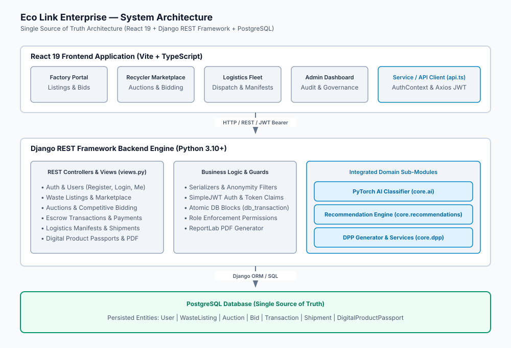
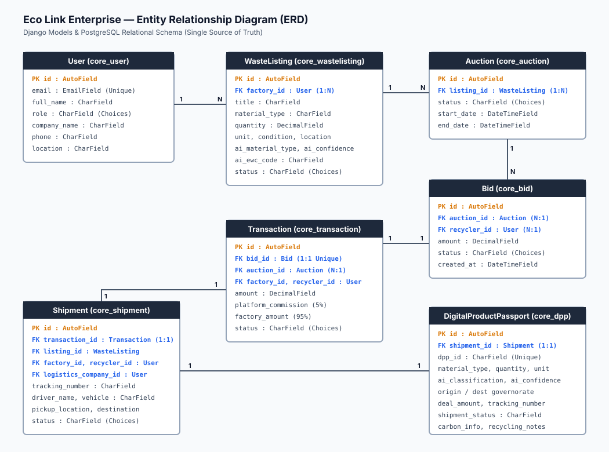

# Eco Link Enterprise — Backend Documentation

This document provides a comprehensive, production-grade technical specification of the Eco Link Enterprise backend implementation. Eco Link is an AI-powered B2B circular economy platform compliant with Egyptian Environmental Law No. 202, connecting industrial waste generators (**Factories**), certified **Recyclers**, and **Logistics** fleet operators into an audit-ready digital ecosystem.

---

## 1. System Architecture

The Eco Link platform follows a decoupled, service-oriented architecture with a React 19 frontend communicating with a Django REST Framework (DRF) backend engine, backed by a PostgreSQL database serving as the **Single Source of Truth**.



### 1.1 Component Responsibilities

* **Frontend Layer (React 19 + TypeScript + Vite)**:
  * Manages UI state and role-gated dashboards (`FactoryDashboard`, `RecyclerDashboard`, `LogisticsDashboard`, `AdminDashboard`).
  * Interacts with the backend exclusively via centralized Axios client (`frontend/src/services/api.ts`).
  * Enforces client-side route protection using `AuthContext` backed by persistent JWTs stored in `localStorage`.
* **Backend Core Engine (Django REST Framework 3.14+)**:
  * Exposes RESTful API endpoints guarded by custom role-based permissions (`IsFactory`, `IsRecycler`, `IsLogistics`, `IsAdminUser`).
  * Encapsulates atomic multi-stage business operations (`db_transaction.atomic()`).
  * Controls corporate anonymity filtering for market integrity during active bidding.
* **Integrated Sub-Modules**:
  * **PyTorch AI Classifier (`core.ai`)**: Fine-tuned ResNet-50 vision model that automatically classifies uploaded industrial waste images, assigns European Waste Catalogue (EWC) codes, estimates hazard levels, and calculates CO2 avoidance potential.
  * **Recommendation Engine (`core.recommendations`)**: Rule-based scoring engine that evaluates active listings against Recycler profile materials, geographic proximity, historical bid quantities, and quality metrics to serve top relevant recommendations.
  * **Digital Product Passport Generator (`core.dpp`)**: Generates standardized, tamper-evident JSON passports and exports downloadable regulatory compliance PDF certificates via ReportLab.
* **Database Layer (PostgreSQL)**:
  * Single source of truth for all system entities, state transitions, manifest tracking, and financial escrow records.

### 1.2 Core Data Flow

1. **Authentication**: Users register or log in via DRF SimpleJWT, receiving access and refresh tokens. The access token contains embedded custom claims (`user_id`, `email`, `role`, `company_name`).
2. **Waste Cataloging**: Factory uploads waste details and images. The PyTorch AI classifier evaluates the image, prepopulating classification metadata.
3. **Marketplace & Bidding**: The system automatically initializes an open `Auction`. Recyclers place monetary bids. DRF serializers redact corporate identities when viewed by Factories to maintain price competition integrity.
4. **Atomic Transaction Instantiation**: Upon Factory bid acceptance, `db_transaction.atomic()` converts the target bid into an accepted bid, rejects competing bids, closes the auction, creates a 5%-commission Escrow `Transaction` (status: `Held`), instantiates a logistics `Shipment` (status: `Pending`), and generates a `DigitalProductPassport`.
5. **Logistics Manifest & Settlement**: Logistics fleet operators transition shipment status (`Pending` → `Assigned` → `Ready for Pickup` → `Picked Up` → `In Transit` → `Delivered`). Upon physical delivery, the Recycler confirms receipt (`Delivered` → `Confirmed`), which atomically settles the escrow transaction (`Held` → `Completed`) and finalizes the DPP.

### 1.3 State Management & Business Logic

State transitions are governed by strict backend state machines:

```
[WasteListing]: Draft ──> Published ──> Completed
[Auction]:      Open ──> Closed / Completed
[Bid]:          Pending ──> Accepted | Rejected
[Transaction]:  Pending ──> Escrow Held ──> Released ──> Completed
[Shipment]:     Pending ──> Assigned ──> Ready for Pickup ──> Picked Up ──> In Transit ──> Delivered ──> Confirmed
```

All state transitions require authenticated action and validate prerequisite states on the backend. No automated status advances occur without user execution.

### 1.4 Authentication & Role Architecture

* **Authentication Standard**: JSON Web Tokens (DRF SimpleJWT).
* **Token Claims**: Access tokens embed `role` to allow instant, secure frontend context initialization.
* **Roles**:
  1. `factory`: Industrial waste generators.
  2. `recycler`: Licensed waste processors.
  3. `logistics`: Certified transport fleet operators.
  4. `admin`: Platform auditors & system administrators.

---

## 2. Database Schema

The database model is implemented in Django (`core/models.py`) and persisted in PostgreSQL.



### 2.1 ERD Overview

```text
  +------------------+         1:N         +----------------------+
  |       User       |<--------------------|     WasteListing     |
  +------------------+                     +----------------------+
    |              |                                  |
    | 1:N          | 1:N                              | 1:N
    v              v                                  v
+--------+    +---------+       1:N                +--------------+
|  Bid   |    |Shipment |<-------------------------|   Auction    |
+--------+    +---------+                          +--------------+
    |              |                                  |
    | 1:1          | 1:1                              | 1:N
    v              v                                  v
+-------------+ +-----------------------+    +-----------------+
| Transaction | |DigitalProductPassport |    |   Transaction   |
+-------------+ +-----------------------+    +-----------------+
```

### 2.2 Core Entities

#### 1. `User` (`core_user`)
Extends `AbstractUser`. Stores platform credentials and organizational identity.
* `id` (AutoField, PK)
* `email` (EmailField, Unique)
* `full_name` (CharField)
* `role` (CharField: `factory`, `recycler`, `logistics`, `admin`)
* `company_name` (CharField)
* `phone` (CharField)
* `location` (CharField)
* `supported_materials` (JSONField, default=list)
* `is_active` (BooleanField)
* `created_at` (DateTimeField)

#### 2. `WasteListing` (`core_wastelisting`)
Industrial waste inventory records generated by Factories.
* `id` (AutoField, PK)
* `factory` (FK → `User`, CASCADE, `related_name='waste_listings'`)
* `title` (CharField)
* `material_type` (CharField)
* `quantity` (DecimalField, 10, 2)
* `unit` (CharField)
* `condition` (CharField)
* `location` (CharField)
* `description` (TextField)
* `images` (CharField/URL)
* `ai_material_type` (CharField, Nullable)
* `ai_confidence` (FloatField, Nullable)
* `ai_ewc_code` (CharField, Nullable)
* `status` (CharField: `draft`, `published`, `completed`)
* `created_at`, `updated_at` (DateTimeField)

#### 3. `Auction` (`core_auction`)
Bidding room linked to a published waste listing.
* `id` (AutoField, PK)
* `listing` (FK → `WasteListing`, CASCADE, `related_name='auctions'`)
* `status` (CharField: `open`, `closed`, `completed`, `cancelled`)
* `start_date`, `end_date`, `created_at` (DateTimeField)

#### 4. `Bid` (`core_bid`)
Financial offers placed by Recyclers on active auctions.
* `id` (AutoField, PK)
* `auction` (FK → `Auction`, CASCADE, `related_name='bids'`)
* `recycler` (FK → `User`, CASCADE, `related_name='bids'`)
* `amount` (DecimalField, 12, 2)
* `status` (CharField: `pending`, `accepted`, `rejected`)
* `created_at`, `updated_at` (DateTimeField)

#### 5. `Transaction` (`core_transaction`)
Financial escrow ledger tracking payment hold and commission allocation.
* `id` (AutoField, PK)
* `auction` (FK → `Auction`, CASCADE, `related_name='transactions'`)
* `bid` (OneToOneField → `Bid`, CASCADE, `related_name='transaction'`)
* `factory` (FK → `User`, CASCADE, `related_name='factory_transactions'`)
* `recycler` (FK → `User`, CASCADE, `related_name='recycler_transactions'`)
* `amount` (DecimalField, 12, 2)
* `platform_commission` (DecimalField, 12, 2, 5% of amount)
* `factory_amount` (DecimalField, 12, 2, 95% of amount)
* `status` (CharField: `Pending`, `Held`, `Released`, `Completed`, `Cancelled`)
* `created_at`, `updated_at` (DateTimeField)

#### 6. `Shipment` (`core_shipment`)
Logistics manifest and waybill tracking material transport.
* `id` (AutoField, PK)
* `transaction` (OneToOneField → `Transaction`, CASCADE, `related_name='shipment'`)
* `listing` (FK → `WasteListing`, CASCADE, `related_name='shipments'`)
* `factory` (FK → `User`, CASCADE, `related_name='factory_shipments'`)
* `recycler` (FK → `User`, CASCADE, `related_name='recycler_shipments'`)
* `logistics_company` (FK → `User`, SET_NULL, Nullable, `related_name='logistics_shipments'`)
* `tracking_number` (CharField, Unique, Format: `TRK-XXXXXXXX`)
* `pickup_location` (CharField)
* `destination` (CharField)
* `driver_name` (CharField)
* `vehicle` (CharField)
* `status` (CharField: `Pending`, `Assigned`, `Ready for Pickup`, `Picked Up`, `In Transit`, `Delivered`, `Confirmed`)
* `pickup_date`, `estimated_arrival`, `delivered_at`, `created_at`, `updated_at` (DateTimeField)

#### 7. `DigitalProductPassport` (`core_dpp`)
Immutable audit passport for circular economy regulatory compliance.
* `id` (AutoField, PK)
* `shipment` (OneToOneField → `Shipment`, CASCADE, `related_name='dpp'`)
* `dpp_id` (CharField, Unique, Format: `DPP-XXXXXXXX`)
* `material_type`, `quantity`, `unit`, `condition` (CharField / DecimalField)
* `ai_classification`, `ai_confidence` (CharField / FloatField)
* `origin_governorate`, `destination_governorate` (CharField)
* `transaction_id_ref` (IntegerField)
* `deal_amount` (DecimalField)
* `deal_date` (DateTimeField)
* `tracking_number` (CharField)
* `logistics_partner` (CharField)
* `pickup_date`, `delivery_date` (DateTimeField, Nullable)
* `shipment_status` (CharField)
* `carbon_info`, `recycling_notes` (JSONField, default=dict)
* `created_at`, `updated_at` (DateTimeField)

### 2.3 Relationships & Cardinality

| Source Entity | Target Entity | Relationship Type | On Delete | Description |
| :--- | :--- | :--- | :--- | :--- |
| `User` | `WasteListing` | One-to-Many (1:N) | CASCADE | Factory owns multiple waste listings. |
| `WasteListing` | `Auction` | One-to-Many (1:N) | CASCADE | Listing can have multiple auction instances over time. |
| `Auction` | `Bid` | One-to-Many (1:N) | CASCADE | Auction collects multiple competing sealed bids. |
| `User` | `Bid` | One-to-Many (1:N) | CASCADE | Recycler submits multiple bids across auctions. |
| `Bid` | `Transaction` | One-to-One (1:1) | CASCADE | Accepted bid maps uniquely to one escrow transaction. |
| `Auction` | `Transaction` | One-to-Many (1:N) | CASCADE | Auction tracks resulting transactions. |
| `Transaction` | `Shipment` | One-to-One (1:1) | CASCADE | Transaction links uniquely to one shipment manifest. |
| `Shipment` | `DigitalProductPassport`| One-to-One (1:1) | CASCADE | Shipment generates one regulatory Digital Product Passport. |

---

## 3. API Endpoints Reference

All API request bodies and response payloads use `application/json`. Authenticated requests require standard HTTP Header:
`Authorization: Bearer <JWT_ACCESS_TOKEN>`

### 3.1 Authentication Endpoints

#### `POST /api/auth/register/`
* **Access**: Public (`AllowAny`)
* **Description**: Registers a new user with a specific role (`factory`, `recycler`, `logistics`, `admin`).
* **Request Payload**:
  ```json
  {
    "full_name": "Cairo Steel Corp",
    "email": "factory@cairosteel.eg",
    "password": "SecurePassword123!",
    "confirm_password": "SecurePassword123!",
    "role": "factory",
    "company_name": "Cairo Steel Industries",
    "phone": "+201001234567"
  }
  ```
* **Success Response (201 Created)**:
  ```json
  {
    "user": {
      "id": 1,
      "full_name": "Cairo Steel Corp",
      "email": "factory@cairosteel.eg",
      "role": "factory",
      "company_name": "Cairo Steel Industries",
      "phone": "+201001234567",
      "is_active": true,
      "created_at": "2026-08-10T12:00:00Z"
    },
    "tokens": {
      "access": "eyJhbGciOi...",
      "refresh": "eyJhbGciOi..."
    }
  }
  ```

#### `POST /api/auth/login/`
* **Access**: Public (`AllowAny`)
* **Description**: Authenticates user email and password, returning JWT tokens and user profile.
* **Request Payload**:
  ```json
  {
    "email": "factory@cairosteel.eg",
    "password": "SecurePassword123!"
  }
  ```
* **Success Response (200 OK)**:
  ```json
  {
    "user": {
      "id": 1,
      "full_name": "Cairo Steel Corp",
      "email": "factory@cairosteel.eg",
      "role": "factory",
      "company_name": "Cairo Steel Industries",
      "phone": "+201001234567"
    },
    "tokens": {
      "access": "eyJhbGciOi...",
      "refresh": "eyJhbGciOi..."
    }
  }
  ```

#### `GET /api/auth/me/`
* **Access**: Authenticated (`IsAuthenticated`)
* **Description**: Returns profile info of the currently logged-in user.

#### `POST /api/auth/token/refresh/`
* **Access**: Public (`AllowAny`)
* **Description**: Refreshes expired access tokens using a valid refresh token.

---

### 3.2 Waste Listings & Marketplace

#### `GET /api/marketplace/listings/` (or `/api/listings/`)
* **Access**: Authenticated (`IsAuthenticated`)
* **Description**: Retrieves published waste listings. Factories receive their own listings; Recyclers receive published listings with anonymized Factory identity.
* **Success Response (200 OK)**:
  ```json
  [
    {
      "id": 10,
      "factory_name": "Verified Industrial Generator",
      "title": "Industrial Scrap Aluminum 6063",
      "material_type": "Aluminum",
      "category": "Non-Ferrous Metals",
      "quantity": 15.5,
      "unit": "Tons",
      "condition": "Clean Offcuts",
      "location": "Helwan, Cairo",
      "description": "High-grade extruded aluminum scrap from manufacturing production line.",
      "images": "/media/uploads/waste_aluminum.jpg",
      "ai_material_type": "Aluminum Scrap",
      "ai_confidence": 0.942,
      "ai_ewc_code": "17 04 02",
      "status": "published",
      "created_at": "2026-08-10T14:30:00Z"
    }
  ]
  ```

#### `POST /api/marketplace/listings/`
* **Access**: Authenticated (`IsAuthenticated`, Factory/Admin)
* **Description**: Creates a new waste listing. Automatically initializes a linked open `Auction` if published.
* **Request Payload**:
  ```json
  {
    "title": "Industrial Scrap Aluminum 6063",
    "material_type": "Aluminum",
    "quantity": 15.5,
    "unit": "Tons",
    "condition": "Clean Offcuts",
    "location": "Helwan, Cairo",
    "description": "High-grade extruded aluminum scrap.",
    "images": "/media/uploads/waste_aluminum.jpg",
    "status": "published"
  }
  ```

#### `GET /api/marketplace/listings/<id>/`
* **Access**: Authenticated (`IsAuthenticated`)
* **Description**: Retrieves detail for a specific waste listing. Redacts `factory` ID for Recyclers.

---

### 3.3 Marketplace & Auctions

#### `GET /api/marketplace/auctions/`
* **Access**: Authenticated (`IsAuthenticated`)
* **Description**: Retrieves open auctions. If query parameter `my_auctions=true` is set by a Factory, retrieves Factory's auctions.

#### `GET /api/marketplace/auctions/<id>/`
* **Access**: Authenticated (`IsAuthenticated`)
* **Description**: Retrieves detailed info for an auction including highest bid amount.

---

### 3.4 Bids

#### `GET /api/marketplace/auctions/<id>/bids/`
* **Access**: Authenticated (`IsAuthenticated`, Listing Owner Factory / Admin)
* **Description**: Retrieves bids submitted for an auction. Uses anonymized bidder representation for Factories (e.g., `Bidder #4`).

#### `POST /api/marketplace/auctions/<id>/bids/`
* **Access**: Authenticated (`IsAuthenticated`, Recycler)
* **Description**: Places a competitive monetary sealed bid.
* **Request Payload**:
  ```json
  {
    "amount": 145000.00
  }
  ```

#### `GET /api/marketplace/my-bids/`
* **Access**: Authenticated (`IsAuthenticated`, Recycler)
* **Description**: Retrieves bids placed by the requesting Recycler across all auctions.

#### `POST /api/marketplace/bids/<id>/accept/`
* **Access**: Authenticated (`IsAuthenticated`, Listing Owner Factory / Admin)
* **Description**: Executes atomic bid acceptance block:
  1. Sets target `Bid` status to `accepted`.
  2. Sets competing bids to `rejected`.
  3. Closes `Auction` and marks `WasteListing` as `completed`.
  4. Creates `Transaction` (amount = bid, commission = 5%, status = `Held`).
  5. Instantiates `Shipment` (status = `Pending`).
  6. Creates `DigitalProductPassport`.
* **Success Response (200 OK)**:
  ```json
  {
    "detail": "Bid accepted successfully. Escrow transaction and shipment created.",
    "transaction_id": 4,
    "shipment_id": 4
  }
  ```

#### `POST /api/marketplace/bids/<id>/reject/`
* **Access**: Authenticated (`IsAuthenticated`, Listing Owner Factory / Admin)
* **Description**: Explicitly rejects a bid.

---

### 3.5 Transactions & Escrow

#### `GET /api/transactions/`
* **Access**: Authenticated (`IsAuthenticated`)
* **Description**: Lists escrow transactions relevant to user role.

#### `GET /api/transactions/<id>/`
* **Access**: Authenticated (`IsAuthenticated`)
* **Description**: Retrieves details of a specific transaction.

#### `POST /api/transactions/<id>/simulate-payment/`
* **Access**: Authenticated (`IsAuthenticated`, Recycler/Admin)
* **Description**: Simulates payment submission transitioning transaction status from `Pending` to `Held`.

#### `POST /api/transactions/<id>/release/`
* **Access**: Authenticated (`IsAuthenticated`, Admin)
* **Description**: Releases escrow funds from `Held` to `Released`.

---

### 3.6 Shipments & Logistics

#### `GET /api/shipments/`
* **Access**: Authenticated (`IsAuthenticated`)
* **Description**: Lists shipments relevant to user role. Logistics operators view assigned shipments and unassigned pending pickups.

#### `GET /api/shipments/<id>/`
* **Access**: Authenticated (`IsAuthenticated`)
* **Description**: Retrieves authoritative shipment record directly from database.

#### `POST /api/shipments/<id>/assign/`
* **Access**: Authenticated (`IsAuthenticated`, Logistics/Admin)
* **Description**: Assigns logistics company, driver, vehicle, and pickup date. Transitions status to `Assigned`.
* **Request Payload**:
  ```json
  {
    "driver_name": "Ahmed Hassan",
    "vehicle": "Mercedes Actros (Plate: Cairo 7842)",
    "pickup_date": "2026-08-11T09:00:00Z"
  }
  ```

#### `POST /api/shipments/<id>/pickup/`
* **Access**: Authenticated (`IsAuthenticated`, Logistics/Admin)
* **Description**: Transitions status from `Assigned` → `Ready for Pickup` → `Picked Up`.

#### `POST /api/shipments/<id>/transit/`
* **Access**: Authenticated (`IsAuthenticated`, Logistics/Admin)
* **Description**: Transitions status from `Picked Up` → `In Transit`.

#### `POST /api/shipments/<id>/deliver/`
* **Access**: Authenticated (`IsAuthenticated`, Logistics/Admin)
* **Description**: Transitions status from `In Transit` → `Delivered`, recording `delivered_at` timestamp.

#### `POST /api/shipments/<id>/confirm/`
* **Access**: Authenticated (`IsAuthenticated`, Recycler/Admin)
* **Description**: Recycler signs delivery receipt. Transitions `Shipment.status` to `Confirmed`, settles linked `Transaction` status to `Completed`, releases escrow funds to Factory, and finalizes DPP status.

---

### 3.7 AI & Image Upload

#### `POST /api/upload/image/`
* **Access**: Authenticated (`IsAuthenticated`)
* **Description**: Accepts multipart file upload and saves image to `/media/uploads/`.
* **Success Response (201 Created)**:
  ```json
  {
    "url": "/media/uploads/waste_sample_984.jpg",
    "filename": "waste_sample_984.jpg"
  }
  ```

#### `POST /api/ai/classify/`
* **Access**: Authenticated (`IsAuthenticated`)
* **Description**: Analyzes uploaded waste image using PyTorch model.
* **Request Payload**:
  ```json
  {
    "image_url": "/media/uploads/waste_sample_984.jpg"
  }
  ```
* **Success Response (200 OK)**:
  ```json
  {
    "predicted_class_index": 2,
    "detected_material": "Aluminum Scrap",
    "category": "Non-Ferrous Metals",
    "confidence": 0.942,
    "confidence_percentage": 94.2,
    "ewc_code": "17 04 02",
    "hazard_level": "Non-Hazardous",
    "co2_factor": 8.9,
    "all_probabilities": {
      "Aluminum Scrap": 0.942,
      "Copper Wire": 0.031,
      "Plastic Polymers": 0.015,
      "Cardboard Waste": 0.008,
      "Glass Cullet": 0.004
    }
  }
  ```

---

### 3.8 Digital Product Passport (DPP)

#### `GET /api/dpp/`
* **Access**: Authenticated (`IsAuthenticated`)
* **Description**: Retrieves DPP records filtered by user role.

#### `GET /api/dpp/<id>/` (or `/api/shipments/<id>/dpp/`)
* **Access**: Authenticated (`IsAuthenticated`)
* **Description**: Returns complete standardized JSON payload for a DPP record.
* **Success Response (200 OK)**:
  ```json
  {
    "document_id": "DPP-98402134",
    "issue_date": "2026-08-10T14:35:00Z",
    "compliance_standard": "EU/EEAA Law No. 202 Digital Product Passport Standard",
    "waste_details": {
      "material_type": "Aluminum Scrap",
      "category": "Non-Ferrous Metals",
      "quantity": 15.5,
      "unit": "Tons",
      "condition": "Clean Offcuts",
      "ewc_code": "17 04 02",
      "ai_classification": "Aluminum Scrap",
      "ai_confidence": 0.942
    },
    "chain_of_custody": {
      "origin_governorate": "Cairo",
      "destination_governorate": "Giza",
      "generator_role": "Verified Industrial Generator",
      "recycler_role": "Certified Waste Recycler",
      "logistics_partner": "Eco Link Logistics Partner"
    },
    "logistics": {
      "tracking_number": "TRK-98402134",
      "driver_name": "Ahmed Hassan",
      "vehicle": "Mercedes Actros (Plate: Cairo 7842)",
      "shipment_status": "Confirmed",
      "pickup_date": "2026-08-11T09:00:00Z",
      "delivery_date": "2026-08-11T14:20:00Z"
    },
    "environmental_impact": {
      "estimated_co2_savings_kg": 137950.0,
      "recyclability_index": "98.5%"
    }
  }
  ```

#### `GET /api/dpp/<id>/pdf/` (or `/api/shipments/<id>/dpp/pdf/`)
* **Access**: Authenticated (`IsAuthenticated`)
* **Description**: Streams downloadable PDF binary file (`application/pdf`) with ReportLab layout.

---

### 3.9 Recommendations

#### `GET /api/recommendations/`
* **Access**: Authenticated (`IsAuthenticated`, Recycler Only)
* **Description**: Returns top 10 personalized waste recommendations scored by material fit, proximity, and historical bid volumes.

---

### 3.10 Logistics Reports

#### `GET /api/logistics/reports/`
* **Access**: Authenticated (`IsAuthenticated`, Logistics Only)
* **Description**: Returns real-time database aggregate counts of shipments across all logistics states (`pending`, `assigned`, `ready_for_pickup`, `picked_up`, `in_transit`, `delivered`, `confirmed_completed`).

---

### 3.11 Admin & System Status

#### `GET /api/admin/stats/`
* **Access**: Authenticated (`IsAuthenticated`, Admin Only)
* **Description**: Returns platform-wide statistics (total users, active listings, open auctions, shipments, total escrow value, total commission earned).

#### `GET /api/admin/users/`
* **Access**: Authenticated (`IsAuthenticated`, Admin Only)
* **Description**: Retrieves full user directory.

#### `GET /api/status/`
* **Access**: Public (`AllowAny`)
* **Description**: Health check endpoint returning platform online status and timestamp.
* **Success Response (200 OK)**:
  ```json
  {
    "status": "online",
    "timestamp": "2026-08-10T20:45:00Z",
    "service": "Eco Link Enterprise Backend API"
  }
  ```
